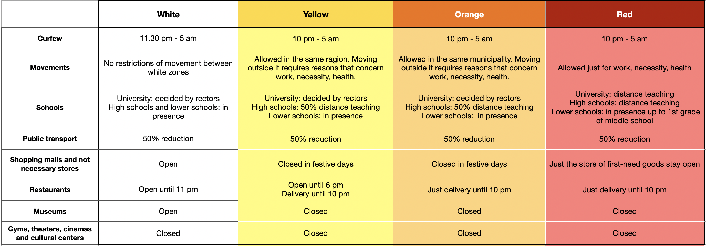

# covid19-phase2-data-italy

## Description

This repository contains complied and curated datasets on COVID-19 epidemiological data at the regional level in Italy in the date range XXXX 2020-XXXX 2021 [MCL: fill dates here], and is designed to enable data analyses on the effects of different kinds of restrictions on the spreading of the infection and on the efficacy of estimators to predict when restrictions should be applied. The data sets are explicitly designed to give access to non-Italian speakers, and all the readme files are in English. 

The repository was the outcome of the Computational Physics Laboratory Course taught in March-May 2021 at the Physics Department of the University of Milan
(Teachers: Marco Cosentino Lagomarsino, Marco Gherardi; Data Challenge Supervisors: Federico Bassetti, Fabrizio Capuani, Pietro Cicuta, Jacopo Grilli)
For more information about the course, see this preprint about the 2020 edition
https://arxiv.org/abs/2104.09394

## Authors 
Marco Cosentino Lagomarsino (University of Milan and IFOM Foundation, Milan)  
Matteo Citterio (University of Milan)  
Marco Gherardi  (University of Milan)  
Dave Parmegiani (University of Milan)  
Nicole Zattarin (University of Milan)

## Repository organisation
The repository is divided into the following folders:

- daily_ region_ data/ (a full dataset with different kinds of standard epidemiological data, taken form the Italian Civil Protection GitHub)
- region_colors/ (compiled datasets regarding the restrictions imposed by the Italian government over the considered period)
- reports_ISS/ (compiled datasets with risk indicators from the Italian National Institute of Health - ISS - weekly reports)
- results/ (report of a few results we obtained with this data set, and corresponding plots)
- deaths: (deaths per province per month, from the Italian Statistics Institute ISTAT)

## Sources
- [Gazzetta Ufficiale della Repubblica Italiana](https://www.gazzettaufficiale.it/home)
- [ISS](https://www.iss.it/web/iss-en)
- [ISTAT](https://www.istat.it/en/archivio/240106)
- [Presidenza del Consiglio dei Ministri - Dipartimento della Protezione Civile](https://github.com/pcm-dpc)

## Datasets
### Introduction
From November 2020  in Italy, the spread of COVID-19 pandemic made necessary to introduce restrictions, in order to reduce the impact of this disease on public health.

### Daily region data
The datasets available in the folder "daily_ region_ data" focus on the daily evolution of epidemiological data during the so called "phase 2" of COVID19 pandemic [MCL:FILL INTERVAL OF DATES HERE]. For instance, we provide daily evolution of parameters such as new cases registered, deaths, and hospitalisations. This kind of data allow a user to study the spread of the pandemic through time-series; you can see an example of possible analysis in [RESULTS](https://github.com/nicolezatta/covid19-phase2-data-Italy/blob/main/results/RESULTS.md).

For a full description of the datasets see: [DAILY_DATA](https://github.com/nicolezatta/covid19-phase2-data-Italy/blob/main/daily_region_data/DAILY_DATA.md)

### Imposed restriction regimes
**Strategy adopted to overcome the pandemia**

We provide data related to the restrictions imposed by the Italian government during the "2nd phase" period that extends from November 2020 to the day writing this file (so at least to the end of May 2021). Such restrictions were applied in an attempt of containing the spread of the COVID-19 epidemic. 

Indeed the Ministry of Health and the ISS in October 2020 published a “Toolbox” for Public Health Authorities responding to the SARS-CoV-2 outbreak in Italy, based on the 8 WHO Strategic Pillars of COVID- 19 response. The aim of this project is to prepare a strategy for the autumn-winter season, see:
[Prevention and response to COVID-19: evolution of strategy and planning in the transition phase for the autumn-winter season](https://github.com/nicolezatta/covid19-phase2-data-Italy/blob/main/COVID%2019_%20strategy_ISS_MoH.pdf).

A compartmental strategy was adopted, differentiating the imposed restriction in each region according to stress on the health system, number of new cases, intensive care occupancy and many other indicators (the list of which can be found in the [INDICATORS.md](https://github.com/nicolezatta/covid19-phase2-data-Italy/blob/main/reports_ISS/INDICATORS.md) file in the reports_ISS folder).

**What do the colors mean?**

The names of the different imposed regimes are, in ascending order of restraint, "white", "yellow", "orange" and "red". The "white" zone corresponds to a level of restraint close to "normality", with open restaurants and shops, and no limitations of movement across the entire region; on the opposite side of the spectrum, in the "red" zone the majority of shops are closed and commercial activities are heavily reduced, on top of travels between cities being forbidden (except for emergencies). Moreover, such restrictions have been subject to change overtime, so updated informations about the restrictions can be found on the [site](http://www.salute.gov.it/portale/nuovocoronavirus/dettaglioFaqNuovoCoronavirus.jsp?lingua=english&id=230#11) of the Italian Ministry of Health.

We're going to describe the restrictions in every zone referring to te period covered by our datasets. Indeed from May on, when we are assembling this repository, restrictions are being relieved. For instance see (in italian) [Coronavirus, cosa si può fare e cosa no nelle zone rosse, gialle e arancioni](https://www.ilsole24ore.com/art/coronavirus-mappa-e-restrizioni-zona-previste-nuovo-dpcm-ADDS4B0?refresh_ce=1).

- White zone restrictions: night curfew moves from 10 pm to 11.30 pm and carry on until 5 am. People are allowed to move freely during this time band in every neighboring region that is white too. School attendance is re-established when possible, while public transports carry half of the passengers. Restaurants open 11 pm while bars are allowed to stay open till 9 pm. Shopping malls and stores are open. Museums are allowed to reopen on weekends. Gyms, theaters, cinemas and cultural centers will be able to reopen gradually, but not in the period considered.

- Yellow zone restrictions: moving around from 11 pm until 5 am is forbidden, outside of this band movements are allowed within the same region. Travelling to other regions has been allowed just in November and half of December, after that moving between yellow regions has been forbidden until 26 April 2021. School attendance is guaranteed for lower schools and at 50% for high schools, public transports carry half of the passengers. Restaurants can be open until 18 pm and until 11 pm for delivery/takeaway. It's only allowed to sit with a maximum of four people per table, unless the people sitting at the same table are cohabitants.
Shopping malls are closed on weekends, while theaters and cinemas stay closed. Gyms, theaters, cinemas and cultural centers will be able to reopen gradually, but not in the period considered.

- Orange zone restrictions: curfew is like in yellow zone, outside of this band movements are allowed within the same municipality. For towns with less than 5000 inhabitants it is possible to travel outside the town without restrictions within a distance of 30km from the town. School attendance and public transport is regulated as in yellow zone. Restaurants can be open until 11 pm just for delivery/takeaway. Other restrictions are as in the previous yellow zone. 

- Red zone restrictions: curfew is like in yellow and orange zone, outside of this band moving around the city is not allowed, unless it’s for work, study or health reasons. Outdoors working out is allowed only if it is individual and in the vicinity of home. Schools attendance is guaranteed just up to 1st grade of middle school, high school student must stay home, as well as university students. Restaurants and bars and cafes are to stay closed. Takeaway is allowed till 10pm and food delivery is allowed nonstop without any restrictions. Shops are to stay closed, except for grocery stores, alimentari, pharmacies, newsstands, tabacchis and other shops that sell essential goods.

**Datasets provided**

The folder "region_colors/" contains data on the regional restrictions imposed by the government over the period [MCL date interval here].We provide two different datasets that are solely focused on such restrictions, and keep track of the restriction color in each region every day.

For a full description of the datasets see: [REGIONS_RESTRICTIONS](https://github.com/nicolezatta/covid19-phase2-data-Italy/blob/main/region_colors/REGIONS_RESTRICTIONS.md)

### Indicators for risk assessment
The folder "report_ISS" provides a compiled dataset for every weekly report published by the ISS, which is the Italian authority in the health field. Every week the ISS provides a report with all the indicators that are necessary to describe the pandemic situation in every region, thus to decide the right policy to apply locally. These reports are avable just in italian, they're all collected [here](https://www.iss.it/monitoraggio-settimanale).

For a more detailed description of the datasets see: [INDICATORS](https://github.com/nicolezatta/covid19-phase2-data-Italy/blob/main/reports_ISS/INDICATORS.md)

### Deaths
The file "deaths.csv" contains a comparison between the mean deaths in 2015-2019 and 2020 deaths, taken from the Italian Institute of Statistics (ISTAT). The deaths are aggregated per month per province. This data set is organized as follows (see also the file header):

- CodProv (Province ISTAT code) 
- deaths per month in the period 2015-2019
- deaths per month in 2020
- deaths per month identified as covid cases (for the second semester of 2020)