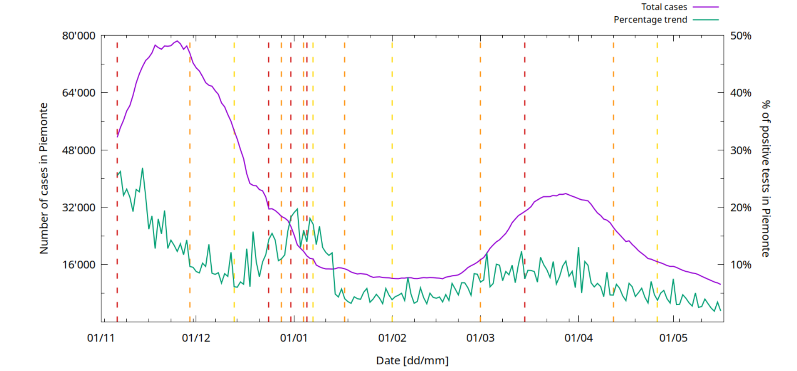
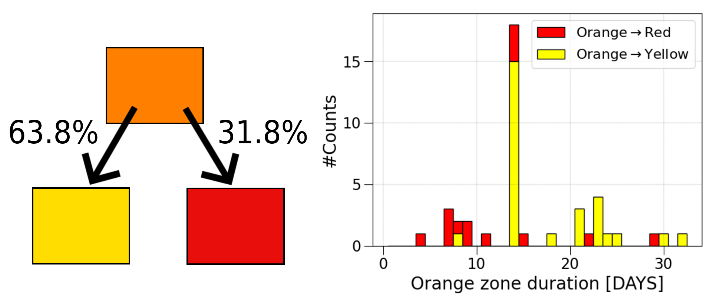
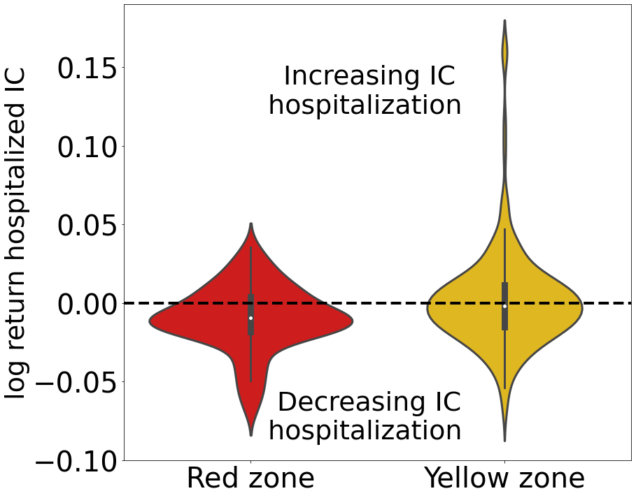
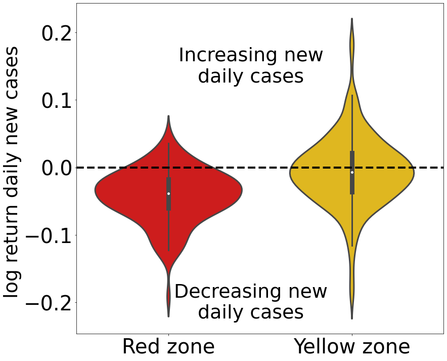
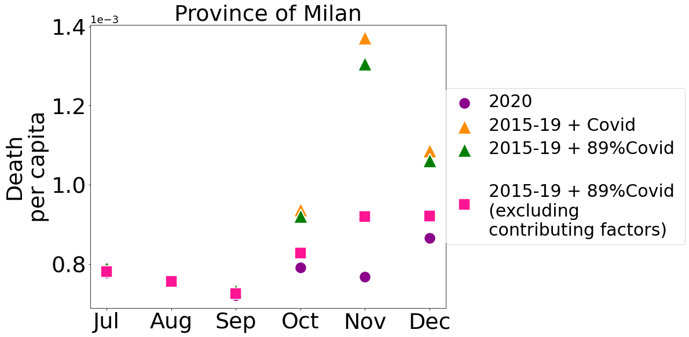

## Content of this document

This document contains a few results obtained by statistical analysis of the data contained in this repository. 

## Time series visualization

We first aim to provide an example of possible direct visualization of the data from the time series provided in this repository. We refer to the dataset [daily_region_data](https://github.com/nicolezatta/covid19-phase2-data-Italy/tree/main/daily_region_data). 

The file [regions_trend_colors.pdf](https://github.com/nicolezatta/covid19-phase2-data-Italy/blob/main/results/images/regions_trend_colors.pdf) contains, for each Italian region, a plot representing the trend of the number of Covid cases and the trend of the daily positive tests percentage. We refer to the latter as "percentage trend". The population of Italian regions varies wildly, so please note that the scale on the y-axes is generally different from region to region, this is an important aspect to consider when analyzing these trends. These plots can be used for a first visual inspection of the difference in each Region's ability to contain the epidemic. An example (for Piemonte) is reported in Figure 1.  

  

**Figure 1. Example of visualization of the data in this repository**. On the time axis, every major tick is the start of a month while every minor tick is the start of a week. The dashed lines indicate a change of restriction regime. Each color represents the new regime that starts from that day until the next dashed line. For instance: when you see a red vertical line followed by an orange one, it means that in that interval the region has underwent a red zone regime.

## The red- and orange-zone restrictions decrease the specific increment of new positives  

Considering all the dates in which one between the Red- Orange- or Yellow-zone restriction has been imposed in every Italian region, we evaluated the effects of the restriction after a time lag of 14 days. The 14 days time shift can be seen as the gap between the exposure to the virus and the outbreak/detection of the symptoms in an individual, see e.g. this [study](https://www.acpjournals.org/doi/10.7326/m20-0504).

In order to quantify the efficacy of a particular restriction we defined the observable *SNP normalized* as the increment of new positives (the difference between the number of new positives recorded the day after a given day and the same number recoded in the day itself) normalized over the current value of new positives. 

Figure 2 compares the histograms of SNP normalized increments. Given the large number of data, a T-test would produce extremely low P-values for both the histograms (from left to right: p1 ~ 4.e(-151), p2 ~ 8.e(-160) ), leading to conclude that differences between the averages of the compared restrictions are statistically significant, i.e. different restrictions have different effectiveness.

  
**Figure 2. Red- and orange-zone restrictions statistically decrease the infection**. The plots report histograms of normalized increments of new cases for different restictions. The split _y_-axis is used to ease the visual comparison of the historgrams. Red- and orange-zone restrictions show a clear bias toward negative normalized increments.  

## Longer-lasting orange-zone restrictions tend to transition to looser restrictions 

We considered all the orange-zone restriction with the exception of the Christmas period (in which restrictions were imposed regardless of the epidemiological situation in an attempt to reduce risks), and asked for their outcome. Figure 3 illustrates this analysis. 63.8% of the applied orange-zone restrictions led to the looser yellow zone. The orange-zone restrictions that had a positive outcome were the longer-lasting ones. This might suggest that the orange zone had an effectiveness in reducing the epidemiological risk, especially considering the fact that the occurrence of the sequences containing the orange zone was 46.5% of the times Y-O-Y and for the 32.5% Y-O-R (2.3% of R-O-R and 18.6% of R-O-Y) suggesting that the outcome is not simply a consequence of the autonomous descent of the epidemiological curve. Conversely, the shorter-lasting orange-zone restrictions might have turned into stricter restrictions before the delay could show their efficacy.    

  
**Figure 3. Transitions from orange-zone to yellow-zone restrictions are more likely and occur for longer-lasting restriction periods**.  Left panel: 63.8% of the times the Orange zone led to the yellow one. Right panel: histogram of orange-zone restriction durations colored by transition. The more an Orange zone persists, the more likely it will become yellow. 

## Red-zone restrictions before Christmas 2020 led to decreased cases and intensive-care hospitalizations

We As above, we performed this analysis us consider the 7 days moving average of the IC occupancy and of the new cases registered daily.  In this case we introduced a 11 days delay shift. After this time we expect that the 97.5% of the exposed population manifested symptoms ([CDC, Interim Clinical Guidance for Management of Patients with Confirmed Coronavirus Disease](https://www.cdc.gov/coronavirus/2019-ncov/hcp/clinical-guidance-management-patients.html)). 

We consider the log returns 
/n(t))&space;),
where _n_ represents either the IC occupancies or the new cases registered daily. The log return measures the daily variation of a quantity independently on the size of the population. Thus, we can compare data from different Italian regions. Hence, we considered agin data from all regions, except for Molise and Valle d'Aosta (since the datasets in these regions present irregular oscillations possibly due to recording mistakes), and the islands, since their epidemiological situation is affected by their geographical isolation.

Figure 4  concerns the red- and yellow-zone restrictions before Christmas 2020 holiday.  At that time, restrictions in Italy became independent from local situations, in order to *prevent* a possible increase of cases due to decreased social distancing and travel. The plots show that, during the red-zone restriction, both IC hospitalizations and daily cases registered tend to decrease. Conversely, during yellow-zone restrictions the growth rates of both IC hospitalizations and new registered cases.

    
**Figure 4. Preventive red-zone restrictions were effective**. The plots show the distribution of log returns for red-zone and yellow-zone restrictions before Christmas 2020, positive log returns corresponding to growth. The distributions referring to red zone exhibit both a negative mean value and a negative peak. Comparing these distributions to the ones concerning yellow zones suggests the latter case the distributions tend to be more symmetric around zero. 

## Time series visualization

We now aim to provide an example of possible direct visualization of the data from the time series provided in this repository. We refer to the dataset [daily_region_data](https://github.com/nicolezatta/covid19-phase2-data-Italy/tree/main/daily_region_data). 

The file [regions_trend_colors.pdf](https://github.com/nicolezatta/covid19-phase2-data-Italy/blob/main/results/images/regions_trend_colors.pdf) contains, for each Region, a plot representing the trend of the number of Covid cases and the trend of the daily positive tests percentage. We refer to the latter "percentage trend".

An example of such series (for Piemonte) is offered by the plot below:

On the time axis, every major tick is the start of a month while every minor tick is the start of a week. The dashed lines indicate a change of restriction regime. Each color represents the new regime that starts from that day until the next dashed line. For instance: when you see a red vertical line followed by an orange one, it means that in that interval the region has underwent a red zone regime.

Regions' populations vary wildly, so please note that the scale on the y-axes is generally different from region to region, this is an important aspect to consider when analyzing these trends.

These graphs show, at a first glance, the difference in each Region's ability to contain the epidemic.

## Deaths in the second semester of 2020 vs previous years
**Introduction**

Let us focus on the Province of Milan, one of the most affected by Covid Pandemic, we now compare the mean deaths in the years 2015-2019 and deaths in 2020. We are focusing on the second semester in order to analyse the second wave of the pandemia.
We assume that the mean mortality in this province is the one reported in the years 2015-19.

**Conclusions**

From the plot below we can conclude that in the 2020's last trimester the mean deaths of 2015-19 plus the deaths due to covid disease exceed significantly the number of deaths per capita of 2020. On the other hand, during the previous months reported values almost coincide, because during summer months the spreading of pandemia was substantially negligible. 

In order to better understand the impact of Covid disease on mortality we refer to what is reported by ISS in [Impact of Covid pandemia on mortality: cause of death in people who died affected by Sars-Cov-2](https://www.istat.it/it/files//2020/07/Report_ISS_Istat_Cause-di-morte-Covid.pdf).

**Figure 5. Preventive red-zone restrictions were effective**. The plots show the distribution of log returns for red-zone and yellow-zone restrictions before Christmas 2020, positive log returns corresponding to growth. The distributions referring to red zone exhibit both a negative mean value and a negative peak. Comparing these distributions to the ones concerning yellow zones suggests the latter case the distributions tend to be more symmetric around zero. 

## Excess mortality due to COVID-19 in late 2020 may be overestimated. 

We analyzed excess mortality in the Province of Milan, one of the most affected by the 2020 COVID-19 Pandemic, comparing the mean mortality in the years 2015-2019 with deaths in 2020. We focused on the second semester in order to analyze the second wave of the pandemic. Figure 5 shows that in the last trimester of 2020 the mean deaths of 2015-19 plus the deaths due to COVID-19 disease exceed significantly the number of deaths per capita of 2020. Conversely, during the previous months the values almost coincide, suggesting that during Summer months the epidemic had a small excess mortality toll in this area. 

In order to better understand the impact of Covid disease on mortality we refer the user to the ISS report [Impact of Covid pandemia on mortality: cause of death in people who died affected by Sars-Cov-2](https://www.istat.it/it/files//2020/07/Report_ISS_Istat_Cause-di-morte-Covid.pdf). According to this report, COVID-19 directly causes death in 89% of the people died with this disease. In addition COVID-19 mortality has a non-trivial intersection (estimated in 71.8%) with at least another possible cause of death. Introducing scalings we see that the sum of usual mortality and death, that we suppose are really caused by Covid, still exceed the observed mortality in 2020, but the values tend to be closer, leading to speculate that COVID-19 might have been mostly an aggravating factor of already existing pathologies in this period of time. 

  
**Figure 6. Excess mortality due to COVID-19 in late 2020 may be overestimated**.  The plot compares mean mortality in the province of Milan in the years 2015-2019 with deaths in 2020 in the same area. The mean deaths of 2015-19 plus the deaths due to COVID-19 disease (orange triangles) exceed significantly the number of deaths per capita of 2020 (circles). Correcting the the data by the fraction of estimated deaths due to COVID-19 (green triangles) does not substantially reduce the gap in the prediction, but adding concurrent causes (squares) reduces the gap drastically. 
