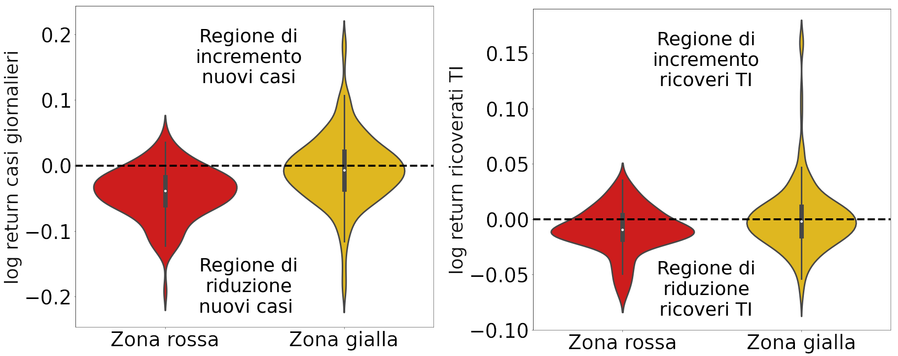

## Yellow and red zones before Christmas
**Introduction**

Let us consider the 7 days moving average of the IC occupancy and of the new cases registered daily. 
It's documented that there's a natural time to observe the results of a restrictive policy. Thus we introduce a 11 days shifting, since after this time we expect that the 97.5% of the exposed population manifested symptoms ([CDC, Interim Clinical Guidance for Management of Patients with Confirmed Coronavirus Disease](https://www.cdc.gov/coronavirus/2019-ncov/hcp/clinical-guidance-management-patients.html)). 

We consider the log return of such quantities (INSERT EQUATION), such observable
measures the daily variation of a quantity, it is independent by the size of the population so that we can compare dataset of different Italian regions.
Therefore we consider data of all regions, exception made by Molise, Valle d'Aosta, since datasets present irregular oscillations, and the islands, since their epidemiological situation is affected by their geographical collocation.

A first result can be gained observing the red and yellow zones before Christmas holiday. In fact at that time restriction became independent from local situations, in order to *prevent* a possible increasing of cases due to people's desire to share time with their relatives. 

